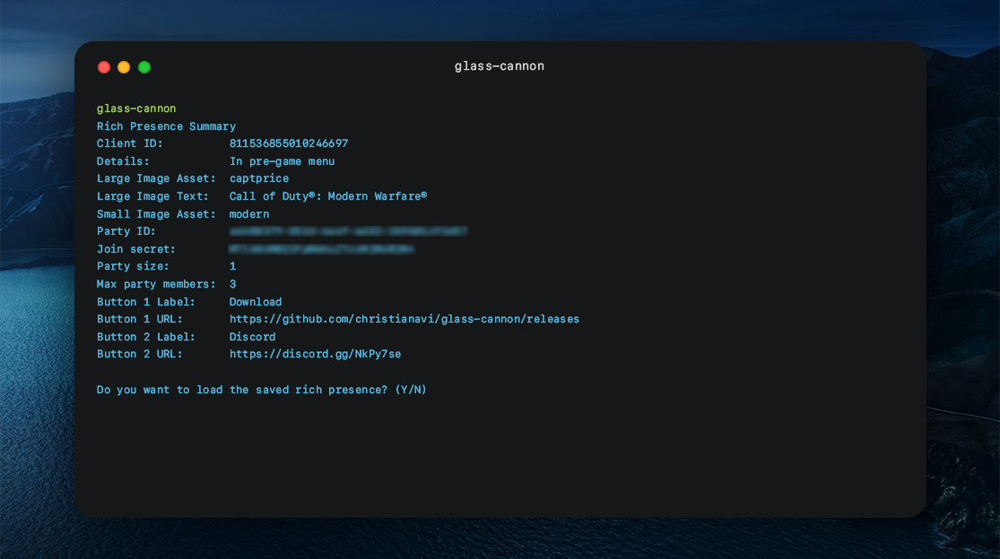
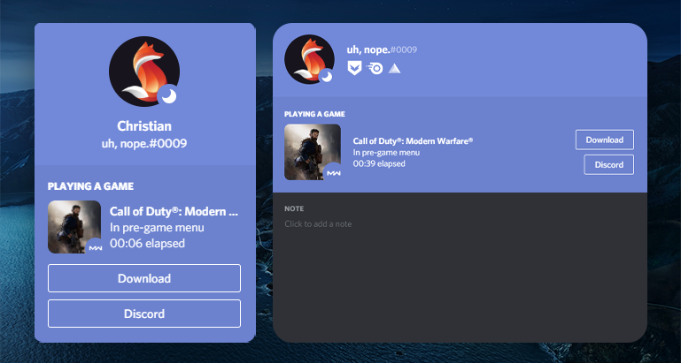

# Glass Cannon
  

Get a custom rich presence on Discord. Change details, state, images, timestamp, and now with **buttons**!

    
Click to view image previews

## Before using
It is important that you have created your own application on [Discord Developer Portal](https://discord.com/developers/applications).
> [Learn how to create a Discord application.](https://github.com/christianavi/glass-cannon/wiki/Creating-a-Discord-Application)

## Running Glass Cannon

### Requirements
* Glass Cannon latest [release](https://github.com/christianavi/glass-cannon/releases).
* Discord application. [Learn how to create a Discord application](https://github.com/christianavi/glass-cannon/wiki/Creating-a-Discord-Application).

The first time you run Glass Cannon, you will be asked to enter the following details about your rich presence:
* Client ID **(REQUIRED)**
* Details 
* State
* Assets
    * Large Image Key
    * Large Image Text
    * Small Image Key
    * Small Image Text
* Timestamp
    * Start Timestamp
    * End Timestamp
* Party Information
    * Party ID
    * Party Size
    * Max Party Members allowed
    * Join Secret - **Ask to join button**
* Buttons - **Your own custom button**

There will be an indicator if the values asked are required or not. If not required, you can simply press <kbd>Enter</kbd> to skip.
> You cannot use Join Secret and Buttons at the same time. [Learn more](https://github.com/christianavi/glass-cannon/wiki/Buttons-vs-Join-Secrets).

After entering the required details, you will be asked if you want to start the presence already. If not, Glass Cannon will exit.
### Subsequent starts
The next time you run Glass Cannon, you will not be asked to enter all those details again. Glass Cannon actually saves your previous rich presence details. Instead, you will be asked if you want to use the previous settings or not.
## FAQs
### Why is the presence did not updating or showing up? Why is it "not working?"
Two things you can do is to
1. Make sure that you are online and not invisible, and the
2. Turn on the **Display currently running game as a status message** option found on Settings > Game Activity.

### Why are images not appearing?
Discord usually takes a few minutes to cache your application assets. Wait a few minutes and run the presence again.

### Why are my buttons not working when clicked?
Due to Discord limitation, you cannot click your own buttons. Rest assured, it works on everybody else.

## Still need help?
Join us on [Discord](https://discord.gg/NkPy7se).
